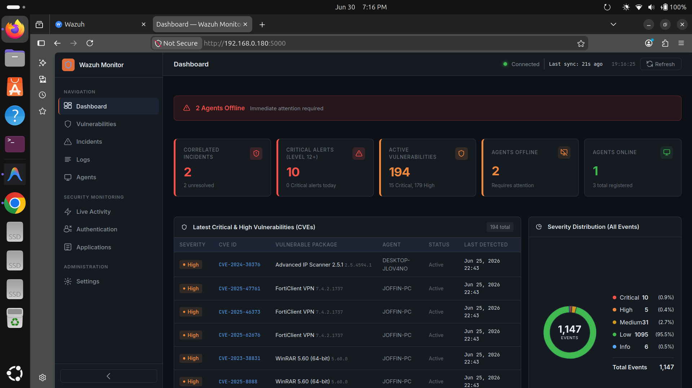
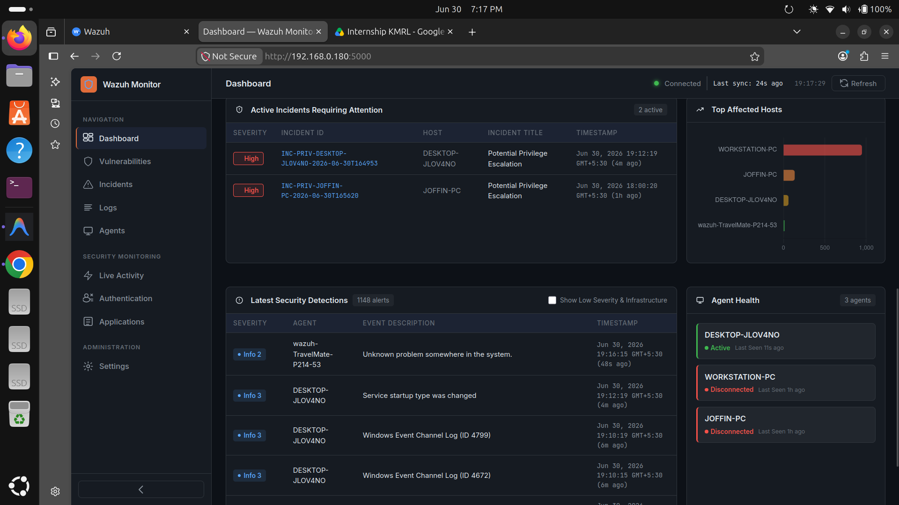
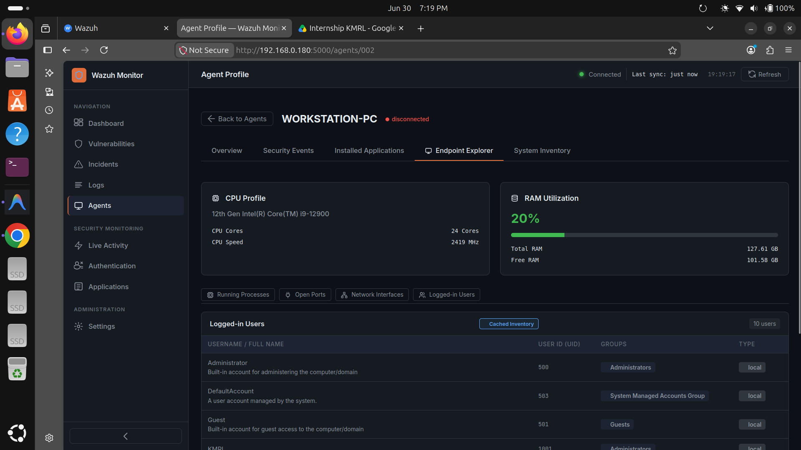
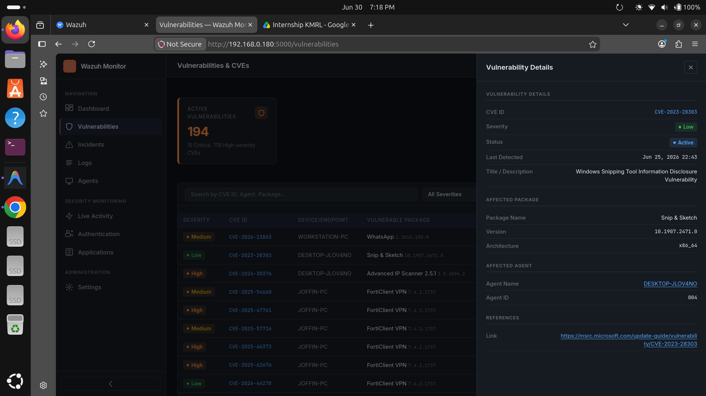

# 🛡️ Wazuh SOC Dashboard

*A modern Security Operations Center dashboard built on Wazuh.*




---

## Who is this for?

- **SOC analysts** wanting a streamlined Wazuh interface
- **Students** learning SIEM and SOC workflows
- **Organizations** running self-hosted Wazuh
- **Security enthusiasts** building home labs

---

## Features

### SOC Overview
Dashboard with severity trends, alert timelines, and agent health monitoring.

### Endpoint Monitoring
Agent Explorer with system inventory, running processes, network ports, and installed software.

### Threat Detection
Correlated incidents (brute force, privilege escalation, malware), authentication event audit, and raw security logs with search and filtering.

### Vulnerability Management
CVE inventory queried from the Wazuh Indexer with severity breakdown and per-agent views.

### Real-Time Endpoint Activity
Live Sysmon events — process creations, network connections, registry changes, DNS queries, and file activity — powered by Wazuh archive logging.







---

## Tech Stack

| Layer | Technology |
|---|---|
| **Backend** | Python, Flask, Requests |
| **Frontend** | Vanilla JavaScript, Chart.js, CSS (dark mode) |
| **Data Sources** | Wazuh Manager API, Wazuh Indexer (OpenSearch), `archives.json` |
| **Production** | Gunicorn, systemd |

---

## Quick Start (Existing Wazuh Deployment)

> Requires a working Wazuh 4.x deployment with archive logging enabled.
> See [docs/INSTALL.md](docs/INSTALL.md) for the full setup guide including Wazuh, Agent, and Sysmon configuration.

```bash
# 1. Clone the repository
git clone https://github.com/YOUR_USERNAME/wazuh-soc-dashboard.git
cd wazuh-soc-dashboard

# 2. Create and activate virtual environment
python3 -m venv venv && source venv/bin/activate

# 3. Install dependencies
pip install -r requirements.txt

# 4. Configure environment
cp .env.example .env && nano .env

# 5. Run the dashboard
python app.py

# 6. Open in browser
# http://localhost:5000
```

---

## Supported Versions

| Component | Version |
|---|---|
| Wazuh | 4.14.x (tested) |
| Python | 3.10+ |
| Sysmon | 15.x |

---

## Architecture at a Glance

```
Browser
    │
    ▼
Flask Backend
    ├── Wazuh Manager API   (agents, alerts, stats)
    ├── Wazuh Indexer        (vulnerabilities)
    └── archives.json        (live Sysmon telemetry)
```

See [docs/ARCHITECTURE.md](docs/ARCHITECTURE.md) for a detailed explanation including data sources, service responsibilities, and design decisions.

---

## 📚 Documentation

For detailed guides, see:

- 📖 [Installation Guide](docs/INSTALL.md) — Full setup from Wazuh to running dashboard
- 🏗️ [Architecture](docs/ARCHITECTURE.md) — Project structure, data flow, and design decisions
- 🛠️ [Troubleshooting](docs/TROUBLESHOOTING.md) — Common issues and fixes

---

## Acknowledgements

- [Wazuh](https://wazuh.com) — Open-source SIEM and XDR platform
- [Microsoft Sysinternals](https://learn.microsoft.com/en-us/sysinternals/downloads/sysmon) — Sysmon endpoint telemetry
- [SwiftOnSecurity](https://github.com/SwiftOnSecurity/sysmon-config) — Sysmon configuration template

---

## Contributing

Contributions are welcome! Please open an issue to discuss proposed changes before submitting a pull request.

---

## License

This project is licensed under the [MIT License](LICENSE).
