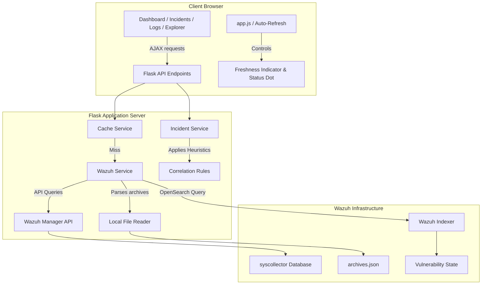

# Architecture

A contributor-oriented overview of how the Wazuh SOC Dashboard is structured and why key decisions were made.

---

## Project Structure

```
wazuh-soc-dashboard/
├── app.py                      # Flask routes and API endpoints
├── config.py                   # Environment variable loader
├── requirements.txt            # Python dependencies
├── .env                        # Your secrets (never commit this)
├── .env.example                # Template for .env
├── .gitignore
│
├── services/
│   ├── wazuh_service.py        # Wazuh API client + archives parser + Sysmon ingest
│   ├── incident_service.py     # Correlation engine (Brute Force, Privilege Esc., etc.)
│   ├── dashboard_service.py    # Dashboard data aggregation helper
│   └── cache_service.py        # In-memory TTL cache to reduce API load
│
├── templates/
│   ├── base.html               # Shared layout, navigation, header
│   ├── dashboard.html          # Main dashboard page
│   ├── agent_detail.html       # Agent profile + Endpoint Explorer tabs
│   ├── live_activity.html      # Sysmon live telemetry viewer
│   ├── incidents.html          # Correlated incident list
│   ├── logs.html               # Raw security log viewer
│   ├── agents.html             # Agent list page
│   ├── vulnerabilities.html    # Vulnerability table
│   ├── applications.html       # Software inventory
│   ├── authentication.html     # Auth event log
│   └── settings.html           # Settings panel
│
├── static/
│   ├── css/
│   │   └── style.css           # Unified dark-mode design system
│   └── js/
│       ├── app.js              # Global state, auto-refresh, notifications
│       ├── dashboard.js        # Dashboard charts and widgets
│       ├── live_activity.js    # Sysmon real-time feed logic
│       ├── agent_detail.js     # Endpoint Explorer tabs
│       ├── incidents.js        # Incident list and status updates
│       ├── logs.js             # Log viewer and search
│       ├── agents.js           # Agent list and filters
│       ├── vulnerabilities.js  # Vuln table and drawer
│       ├── applications.js     # Applications inventory
│       ├── authentication.js   # Auth log viewer
│       └── settings.js         # Settings form and connection test
│
├── assets/
│   └── screenshots/            # Project screenshots for README
│
└── docs/
    ├── INSTALL.md              # Full installation guide
    ├── ARCHITECTURE.md         # This file
    └── TROUBLESHOOTING.md      # Known issues and fixes
```

---

## Data Sources

This dashboard combines data from three sources:

### Wazuh Manager API (port 55000)

- Agent inventory and status
- System collector (hardware, OS, processes, ports, installed packages)
- Alert statistics and rule metadata
- SCA and syscheck results

### Wazuh Indexer / OpenSearch (port 9200)

- Vulnerability state (`wazuh-states-vulnerabilities-*` index)

### Local Filesystem (`archives.json`)

- Live Sysmon telemetry (process creations, network connections, registry changes, DNS queries, file creations)
- Raw event data for the security logs view
- Source data for incident correlation

---

## Service Responsibilities

### `wazuh_service.py`

The central communication tier. Handles OAuth token retrieval, header management, and automatic re-authentication on token expiration (HTTP 401). Provides typed methods for every Wazuh API endpoint used by the dashboard (agents, syscollector, SCA, syscheck). Also reads and parses `archives.json` from the local filesystem to power the Live Activity view, normalizing raw events into a consistent format with category classification and Sysmon event enrichment.

### `incident_service.py`

Correlation engine that groups raw security alerts into unified incidents. Applies three heuristic rules: **privilege escalation** (special privilege assignment followed by service creation), **brute force detection** (5+ consecutive failed logins, escalated to critical if followed by a successful login), and **malware detection** (virus/trojan signature matches). Maintains persistent state in a local JSON file so incident statuses (Open, Investigating, Resolved, False Positive) survive restarts.

### `dashboard_service.py`

Aggregation layer that assembles the main dashboard payload in a single call. Pulls stats, security summaries, agent lists, latest alerts, and active incidents from the other services and returns them as one JSON response.

### `cache_service.py`

Thread-safe in-memory TTL cache. Stores API responses for 15–60 seconds depending on the data type. Prevents excessive Wazuh API calls during rapid page loads or auto-refresh cycles. Implemented as a module-level singleton so all services share the same cache instance.

---

## Data Flow



---

## Archives vs. Alerts

Wazuh normally stores alerts in `alerts.json`, which only contains events that matched Wazuh rules. This dashboard also relies on `archives.json`, which is produced by enabling Wazuh archive logging (`logall_json=yes`). Reading `archives.json` allows the application to display complete Sysmon telemetry and other raw events in the Live Activity view, not just alerts.

This distinction matters because many Sysmon events (process creations, DNS queries, registry modifications) may not trigger any Wazuh detection rule, but are still valuable for SOC analysts investigating endpoint activity.

---

## Frontend

The frontend uses vanilla JavaScript with page-specific script files. Each page (dashboard, agents, incidents, etc.) has a corresponding `.js` file that handles data fetching, rendering, and user interaction.

Key patterns:
- **Auto-refresh**: A global `startAutoRefresh(interval, callback)` function polls the Flask API at a configurable interval (default 30 seconds).
- **Freshness indicator**: `markRefreshSuccess()` and `markRefreshFailure()` update the connection status dot in the header.
- **Chart.js**: Used for the dashboard trend line and severity distribution charts.
- **Dark mode**: A unified CSS design system using CSS custom properties, Inter font, and a GitHub-inspired dark palette.

---

## Design Decisions

| Decision | Rationale |
|:---|:---|
| **Read `archives.json` instead of `alerts.json`** | Live Activity needs all telemetry, not just rule-matched alerts. Archive logging captures every collected event including Sysmon data that may not trigger Wazuh rules. |
| **Vulnerability data from the Indexer** | Wazuh stores vulnerability state in the OpenSearch Indexer under `wazuh-states-vulnerabilities-*` rather than exposing the complete dataset through the Manager REST API. The dashboard queries the Indexer directly because that is where Wazuh makes this data available. |
| **In-memory TTL cache on API responses** | The Wazuh API has rate limits and latency. Caching frequently-requested data for 15–60 seconds reduces API load and improves dashboard responsiveness during auto-refresh cycles. |
| **Flask as the backend** | Lightweight, minimal boilerplate, sufficient for a proxy/aggregation layer that sits between the browser and Wazuh's APIs. No need for async capabilities or ORM features that heavier frameworks provide. |

---

## Limitations

- **`archives.json` file size**: The file is read from local disk. Performance degrades on very large archive files as the backward-read buffer must seek through more data.
- **Cache isolation**: The in-memory cache is not shared across Gunicorn workers. Each worker maintains its own cache, which can lead to redundant API calls in multi-worker deployments.
- **Incident correlation on request**: Correlation rules run on every request to the incidents endpoint rather than as a background job. This is fast enough for typical alert volumes but may slow down with very large datasets.
