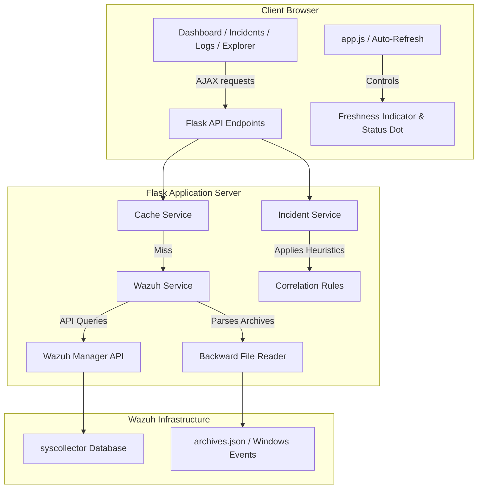

# Wazuh Monitor — System Architecture & Feature Documentation

Wazuh Monitor is a high-fidelity SIEM (Security Information and Event Management) dashboard and telemetry analysis platform built on top of the Wazuh API. It provides security administrators with real-time, consolidated visibility into endpoint health, live Sysmon activity, system inventories, and correlated security incidents.

---

## 1. Technology Stack

### Backend
* **Core Framework**: Python Flask (`app.py`) provides the web routing, authentication middleware, and API aggregation endpoints.
* **Wazuh Service (`services/wazuh_service.py`)**: The central communication tier with the Wazuh Manager API.
  - Implements OAuth token retrieval, header management, and request auto-retry on token expiration (HTTP 401).
  - Integrates an in-memory caching mechanism (`services/cache_service.py`) to reduce network overhead on repetitive queries.
* **Incident Correlation Service (`services/incident_service.py`)**: An ingestion-time correlation tier that parses raw alerts and correlates security event chains into unified incidents.

### Frontend
* **Core**: Semantic HTML5 and Vanilla CSS3 with a unified dark-mode security theme (glassmorphism overlays, custom gradients).
* **Interactivity**: Pure Vanilla JavaScript (`static/js/app.js`, `dashboard.js`, `live_activity.js`, etc.) manages asynchronous state, page routing, tabs, drawers, and notifications.
* **Data Visualization**: Chart.js renders the live timeline trend graphs and agent comparison charts.

---

## 2. Core Modules & Features

### A. Dashboard Home
* **Today's Security Summary**: High-level alert count metrics (Failed Logins, Software Changes, Malware Detections, Offline Agents).
* **Agent Overview**: Live connection monitoring displaying total, online, and offline agents with connection status indicators.
* **Alert Trend Line**: Visualizes telemetry ingestion trends over a rolling 24-hour window.
* **Severity Distribution Panel**: Summarizes active alerts categorized by severity (Critical, High, Medium, Low, Info).

### B. Endpoint Explorer
An interactive inventory viewer mapping live hardware and operating system parameters:
* **System Info**: BIOS serials, motherboards, kernel versions, and OS platforms.
* **Running Processes**: Displays active processes with Capitalized styled state badges (`Running`, `Sleeping`, `Zombie`, `Active`) and parent process owners.
* **Network Ports**: Lists listening and active TCP/UDP ports with corresponding protocol versions.
* **Logged-in Users**: Audits active sessions, logon terminals, and source IPs.
* **Installed Applications**: Shows installed software versions and installation timestamps.

### C. Live Activity (Sysmon Ingest)
Real-time ingestion of raw endpoint telemetry. It reads from `/var/ossec/logs/archives/archives.json` and parses Sysmon event channels:
* **Process Creations (ID 1)**: Tracks command-line executions, hashes, and parent binaries.
* **Network Connections (ID 3)**: Audits incoming/outgoing connections, IPs, ports, and protocols.
* **Registry Value Set (ID 12/13/14)**: Inspects modifications to core Windows registry paths.
* **File Creations (ID 11)**: Logs new file creations (such as downloads or temp files).
* **DNS Queries (ID 22)**: Logs lookups for domains.
* **WMI Activity (ID 19/20/21)**: Captures WMI filter and consumer creations.

### D. Correlated Incidents (SIEM Engine)
Aggregates alerts using correlation rules:
* **Potential Privilege Escalation**: Grouping special privilege assignments (Event 4672) with subsequent service creations (Event 7045).
* **Brute Force Detection**: Correlates 5+ consecutive failed login attempts; upgrades severity to **Critical** if followed by a successful login by the same user.
* **Malware Detections**: Groups virus database signatures and malware logs.
* **Fallback RAW Alerts**: Catches general alerts of Rule Level $\ge 8$ and registers them as individual incidents.

### E. Security Logs
* An audit viewer of raw security alerts with a real-time regex text search, severity filter, and full-detail json drawer overlay.

---

## 3. Key Telemetry Stabilization Implementations

### I. Sysmon Noise Suppression Filter
To prevent dashboard fatigue and false positive critical incidents, `wazuh_service.py` implements a noise filter targeting benign background Windows operations:
1. **Process Access (Event ID 10)**: Suppresses alerts generated by standard software accessing OS binaries:
   - *Antivirus*: Kaspersky (`avp.exe` / Network Agent).
   - *Storage Sync*: Microsoft OneDrive (`onedrive.exe`).
   - *Graphics utilities*: NVIDIA Desktop Manager (`nViewMain64.exe`).
   - *User utilities*: Wondershare push service (`WsNativePushService.exe`), Microsoft Edge WebViews, and Grammarly.
2. **Registry Changes (Event ID 12/13/14)**: Suppresses routine system activity:
   - CapabilityAccessManager (`ConsentStore`) location/camera consent queries.
   - Background Activity Moderator (`bam\State\UserSettings`) app execution statistics.
   - Routine registry modifications conducted by the standard service host (`svchost.exe`).
3. **DNS Query Logs (Event ID 22)**: Filters out lookups by `svchost.exe` or requests targeting trusted vendors (e.g. Autodesk, Epic Games, Grammarly, Kaspersky, Google, WhatsApp, Facebook).

### II. Graceful Vulnerability API 404 Handling
For endpoints without scanner databases (which return HTTP 404 from the Wazuh Manager `/vulnerability/{agent_id}` endpoint):
* An `ignore_404=True` flag was introduced into the `_get` API client helper.
* If a 404 is encountered, the service returns an empty dictionary `{}` instead of raising a `RuntimeError`, allowing the UI to render an empty vulnerabilities table gracefully instead of throwing crash headers.

### III. Synthetic Event Rule Generation
Many raw Windows event logs stored in `archives.json` do not trigger Wazuh alert rules (and therefore lack a `"rule"` object block). The backend automatically intercepts these events during parsing and generates a **synthetic rule block** (level 3/info), ensuring these logs populate the live dashboard activity views rather than being dropped.

### IV. Global Freshness Synchronization
* Standardized `startAutoRefresh(30, ...)` loops and a `refreshPage()` event hook across Logs, Agents, Agent Detail, and Incidents views.
* Integrates `markRefreshSuccess()` and `markRefreshFailure()` calls to reset the top header connection dot (connected/disconnected) and maintain the rolling **Last sync: just now** freshness status counter.
